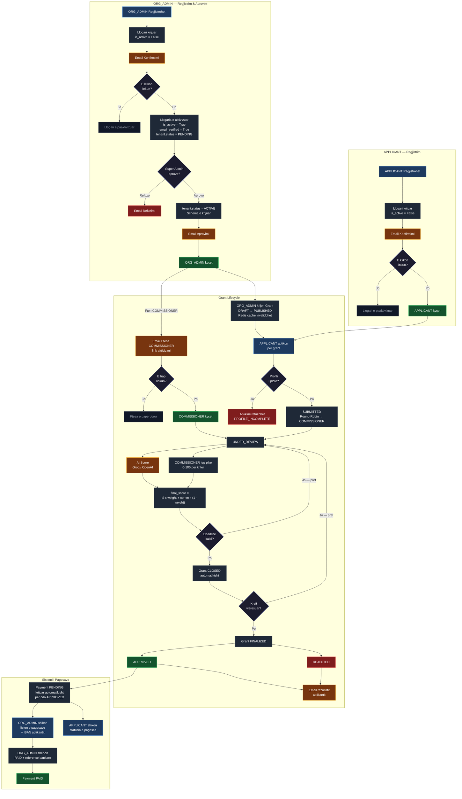

```mermaid
flowchart TD
    subgraph ORG["ORG_ADMIN — Regjistrim & Aprovim"]
        A["ORG_ADMIN Regjistrohet"]:::blue
        B["Llogari krijuar\nis_active = False"]:::dark
        C["Email Konfirmimi"]:::orange
        D{"E klikon\nlinkun?"}:::decision
        E["Llogari e paaktivizuar"]:::muted
        F["Llogaria e aktivizuar\nis_active = True\nemail_verified = True\ntenant.status = PENDING"]:::dark
        G{"Super Admin\naprovo?"}:::decision
        H["Email Refuzimi"]:::red
        I["tenant.status = ACTIVE\nSchema e krijuar"]:::dark
        J["Email Aprovimi"]:::orange
        K["ORG_ADMIN kyçet"]:::green

        A --> B --> C --> D
        D -->|"Jo"| E
        D -->|"Po"| F --> G
        G -->|"Refuzo"| H
        G -->|"Aprovo"| I --> J --> K
    end

    subgraph APP["APPLICANT — Regjistrim"]
        AP_A["APPLICANT Regjistrohet"]:::blue
        AP_B["Llogari krijuar\nis_active = False"]:::dark
        AP_C["Email Konfirmimi"]:::orange
        AP_D{"E klikon\nlinkun?"}:::decision
        AP_E["Llogari e paaktivizuar"]:::muted
        AP_F["APPLICANT kyçet"]:::green

        AP_A --> AP_B --> AP_C --> AP_D
        AP_D -->|"Jo"| AP_E
        AP_D -->|"Po"| AP_F
    end

    subgraph FLOW["Grant Lifecycle"]
        L["Email Ftese COMMISSIONER\nlink aktivizimi"]:::orange
        L_D{"E hap\nlinkun?"}:::decision
        L_NO["Ftesa e paperdorur"]:::muted
        M["COMMISSIONER kyçet"]:::green

        N["ORG_ADMIN krijon Grant\nDRAFT → PUBLISHED\nRedis cache invalidohet"]:::dark

        P["APPLICANT aplikon\nper grant"]:::blue
        P_CHECK{"Profili\ni plotë?"}:::decision
        P_FAIL["Aplikimi refuzohet\nPROFILE_INCOMPLETE"]:::red
        P_SUB["SUBMITTED\nRound-Robin → COMMISSIONER"]:::dark

        Q["UNDER_REVIEW"]:::dark
        S["AI Score\nGroq / OpenAI"]:::orange
        T["COMMISSIONER jep pike\n0-100 per kriter"]:::dark
        U["final_score =\nai x weight + comm x (1 - weight)"]:::dark

        DEADLINE{"Deadline\nkaloi?"}:::decision
        CLOSE["Grant CLOSED\nautomatikisht"]:::dark
        ALL_SCORED{"Krejt\nvleresuar?"}:::decision
        FIN["Grant FINALIZED"]:::dark

        W["APPROVED"]:::green
        X["REJECTED"]:::red
        Y["Email rezultatit\naplikantit"]:::orange

        L --> L_D
        L_D -->|"Jo"| L_NO
        L_D -->|"Po"| M
        M --> Q
        N --> P
        P --> P_CHECK
        P_CHECK -->|"Jo"| P_FAIL
        P_CHECK -->|"Po"| P_SUB --> Q
        Q --> S & T
        S & T --> U --> DEADLINE
        DEADLINE -->|"Jo — pret"| Q
        DEADLINE -->|"Po"| CLOSE --> ALL_SCORED
        ALL_SCORED -->|"Jo — pret"| Q
        ALL_SCORED -->|"Po"| FIN --> W & X --> Y
    end

    subgraph PAY["Sistemi i Pagesave"]
        PAY_A["Payment PENDING\nkrijuar automatikisht\nper cdo APPROVED"]:::dark
        PAY_B["ORG_ADMIN shikon\nlisten e pagesave\n+ IBAN aplikantit"]:::blue
        PAY_C["ORG_ADMIN shenon\nPAID + reference bankare"]:::dark
        PAY_D["Payment PAID"]:::green
        PAY_E["APPLICANT shikon\nstatusin e pageses"]:::blue

        PAY_A --> PAY_B --> PAY_C --> PAY_D
        PAY_A --> PAY_E
    end

    K -->|"Fton COMMISSIONER"| L
    K --> N
    AP_F --> P
    W --> PAY_A

    classDef blue     fill:#1e3a5f,stroke:#60a5fa,color:#fff
    classDef dark     fill:#1F2937,stroke:#4B5563,color:#fff
    classDef orange   fill:#78350f,stroke:#f59e0b,color:#fff
    classDef green    fill:#14532d,stroke:#22c55e,color:#fff
    classDef red      fill:#7f1d1d,stroke:#ef4444,color:#fff
    classDef muted    fill:#111827,stroke:#6B7280,color:#9CA3AF
    classDef decision fill:#1c1c2e,stroke:#818cf8,color:#fff
```

```mermaid
erDiagram

    %% ─── PUBLIC SCHEMA ───────────────────────────────────────

    Tenant {
        UUID id PK
        VARCHAR slug UK
        VARCHAR name
        ENUM status
        VARCHAR email
        VARCHAR nipt
        VARCHAR doc_path
        BOOLEAN is_active
        TIMESTAMPTZ created_at
        TIMESTAMPTZ updated_at
    }

    User {
        UUID id PK
        VARCHAR email UK
        VARCHAR password_hash
        VARCHAR first_name
        VARCHAR last_name
        BOOLEAN is_active
        BOOLEAN email_verified
        TIMESTAMPTZ created_at
        TIMESTAMPTZ updated_at
    }

    UserProfile {
        UUID id PK
        UUID user_id FK
        VARCHAR phone
        VARCHAR profile_picture
        VARCHAR address
        VARCHAR iban
    }

    ApplicantProfile {
        UUID id PK
        UUID user_id FK
        VARCHAR personal_id
        ENUM applicant_type
        BOOLEAN has_prev_grant
        TEXT description
        VARCHAR study_level
        VARCHAR university
        VARCHAR business_name
        VARCHAR org_name
        VARCHAR profession
    }

    Role {
        UUID id PK
        ENUM name UK
    }

    Permission {
        UUID id PK
        VARCHAR codename UK
        VARCHAR resource
        VARCHAR action
    }

    RolePermission {
        UUID id PK
        UUID role_id FK
        UUID permission_id FK
    }

    UserRole {
        UUID id PK
        UUID user_id FK
        UUID role_id FK
        UUID tenant_id FK
        TIMESTAMPTZ created_at
    }

    RefreshToken {
        UUID id PK
        VARCHAR token_hash UK
        UUID user_id FK
        VARCHAR tenant_slug
        VARCHAR role
        TIMESTAMPTZ expires_at
        BOOLEAN is_revoked
    }

    PasswordResetToken {
        UUID id PK
        UUID user_id FK
        VARCHAR token UK
        TIMESTAMPTZ expires_at
        BOOLEAN is_used
    }

    EmailVerificationToken {
        UUID id PK
        UUID user_id FK
        VARCHAR token UK
        TIMESTAMPTZ expires_at
    }

    AuditLog {
        UUID id PK
        UUID user_id FK
        UUID tenant_id FK
        VARCHAR action
        VARCHAR entity
        UUID entity_id
        JSONB details
        VARCHAR ip_address
        TIMESTAMPTZ created_at
    }

    %% ─── TENANT SCHEMA (per organizatë) ──────────────────────

    Grant {
        UUID id PK
        VARCHAR title
        TEXT description
        NUMERIC budget
        VARCHAR currency
        NUMERIC grant_value
        TIMESTAMPTZ deadline
        INTEGER max_applicants
        ENUM status
        ENUM applicant_type
        NUMERIC ai_weight
        UUID created_by FK
        TIMESTAMPTZ created_at
        TIMESTAMPTZ updated_at
    }

    Criteria {
        UUID id PK
        UUID grant_id FK
        VARCHAR name
        NUMERIC weight
        NUMERIC min_value
        BOOLEAN is_required
    }

    GrantTag {
        UUID id PK
        UUID grant_id FK
        VARCHAR tag
    }

    ApplicationQuestion {
        UUID id PK
        UUID grant_id FK
        TEXT question_text
        ENUM question_type
        BOOLEAN is_required
        INTEGER order_no
    }

    Application {
        UUID id PK
        UUID grant_id FK
        UUID user_id FK
        ENUM status
        TEXT motivation_letter
        TIMESTAMPTZ submitted_at
        UUID decided_by FK
        UUID assigned_to FK
        TIMESTAMPTZ created_at
        TIMESTAMPTZ updated_at
    }

    ApplicationAnswer {
        UUID id PK
        UUID application_id FK
        UUID question_id FK
        TEXT answer_text
        TIMESTAMPTZ created_at
    }

    Attachment {
        UUID id PK
        UUID application_id FK
        VARCHAR file_path
        VARCHAR file_name
        VARCHAR file_type
        INTEGER size_bytes
        TIMESTAMPTZ uploaded_at
    }

    CV {
        UUID id PK
        UUID application_id FK
        VARCHAR file_path
        VARCHAR file_name
        TEXT parsed_text
        TIMESTAMPTZ uploaded_at
    }

    AIScore {
        UUID id PK
        UUID application_id FK
        NUMERIC ai_score
        TEXT justification
        NUMERIC commissioner_score
        NUMERIC final_score
        INTEGER rank_position
        VARCHAR model_used
        BOOLEAN is_cached
        TIMESTAMPTZ scored_at
    }

    CommissionerScore {
        UUID id PK
        UUID application_id FK
        UUID commissioner_id FK
        UUID criteria_id FK
        INTEGER score
        TEXT comment
        TIMESTAMPTZ created_at
    }

    CommissionerDecision {
        UUID id PK
        UUID application_id FK
        UUID commissioner_id FK
        ENUM decision
        TEXT reason
        TIMESTAMPTZ decided_at
    }

    CommissionerWorkload {
        UUID id PK
        UUID commissioner_id FK
        INTEGER assigned_count
        INTEGER completed_count
        TIMESTAMPTZ updated_at
    }

    ApplicationStatusUpdate {
        UUID id PK
        UUID application_id FK
        ENUM old_status
        ENUM new_status
        UUID changed_by FK
        TIMESTAMPTZ changed_at
    }

    Payment {
        UUID id PK
        UUID application_id FK
        NUMERIC amount
        VARCHAR currency
        ENUM status
        VARCHAR reference
        TIMESTAMPTZ paid_at
        UUID paid_by FK
        VARCHAR note
        TIMESTAMPTZ created_at
    }

    Invitation {
        UUID id PK
        VARCHAR email
        UUID role_id FK
        UUID invited_by FK
        TEXT token UK
        TIMESTAMPTZ expires_at
        BOOLEAN is_used
        UUID accepted_by FK
    }

    EmailLog {
        UUID id PK
        VARCHAR to_email
        VARCHAR subject
        TEXT body
        ENUM status
        TIMESTAMPTZ sent_at
        TIMESTAMPTZ created_at
    }

    %% ─── PUBLIC SCHEMA LIDHJET ───────────────────────────────

    User ||--o| UserProfile : "ka"
    User ||--o| ApplicantProfile : "ka"
    User ||--o{ UserRole : "ka"
    User ||--o{ RefreshToken : "ka"
    User ||--o{ PasswordResetToken : "ka"
    User ||--o{ EmailVerificationToken : "ka"

    Role ||--o{ RolePermission : "ka"
    Permission ||--o{ RolePermission : "i takon"
    Role ||--o{ UserRole : "i caktohet"
    Tenant ||--o{ UserRole : "permban"

    %% ─── TENANT SCHEMA LIDHJET ───────────────────────────────

    Grant ||--o{ Criteria : "ka"
    Grant ||--o{ GrantTag : "ka"
    Grant ||--o{ ApplicationQuestion : "ka"
    Grant ||--o{ Application : "permban"

    Application ||--o{ ApplicationAnswer : "ka"
    Application ||--o{ Attachment : "ka"
    Application ||--o| CV : "ka"
    Application ||--o| AIScore : "ka"
    Application ||--o{ CommissionerScore : "ka"
    Application ||--o| CommissionerDecision : "ka"
    Application ||--o{ ApplicationStatusUpdate : "ka"
    Application ||--o| Payment : "ka"

    ApplicationQuestion ||--o{ ApplicationAnswer : "pergjigjet"
    Criteria ||--o{ CommissionerScore : "vlereson"
```
