# Database Schema

GrantFlow uses **PostgreSQL** with a multi-schema architecture:

- **`public` schema** — shared tables used across all organizations (users, roles, tenants, permissions)
- **`tenant_{slug}` schema** — one isolated schema per organization, created automatically on approval

This provides complete data isolation between organizations at the database level. Queries for tenant-specific data use `SET search_path TO tenant_{slug}, public`, handled transparently by `TenantMiddleware`.

---

## Entity Relationship Diagram

```mermaid
erDiagram

    %% ─── PUBLIC SCHEMA ───────────────────────────────────────

    Tenant {
        UUID id PK
        VARCHAR slug UK
        VARCHAR name
        ENUM status
        VARCHAR email
        VARCHAR nipt
        VARCHAR doc_path
        BOOLEAN is_active
        TIMESTAMPTZ created_at
        TIMESTAMPTZ updated_at
    }

    User {
        UUID id PK
        VARCHAR email UK
        VARCHAR password_hash
        VARCHAR first_name
        VARCHAR last_name
        BOOLEAN is_active
        BOOLEAN email_verified
        TIMESTAMPTZ created_at
        TIMESTAMPTZ updated_at
    }

    UserProfile {
        UUID id PK
        UUID user_id FK
        VARCHAR phone
        VARCHAR profile_picture
        VARCHAR address
        VARCHAR iban
    }

    ApplicantProfile {
        UUID id PK
        UUID user_id FK
        VARCHAR personal_id
        ENUM applicant_type
        BOOLEAN has_prev_grant
        TEXT description
        VARCHAR study_level
        VARCHAR university
        VARCHAR business_name
        VARCHAR org_name
        VARCHAR profession
    }

    Role {
        UUID id PK
        ENUM name UK
    }

    Permission {
        UUID id PK
        VARCHAR codename UK
        VARCHAR resource
        VARCHAR action
    }

    RolePermission {
        UUID id PK
        UUID role_id FK
        UUID permission_id FK
    }

    UserRole {
        UUID id PK
        UUID user_id FK
        UUID role_id FK
        UUID tenant_id FK
        TIMESTAMPTZ created_at
    }

    RefreshToken {
        UUID id PK
        VARCHAR token_hash UK
        UUID user_id FK
        VARCHAR tenant_slug
        VARCHAR role
        TIMESTAMPTZ expires_at
        BOOLEAN is_revoked
    }

    PasswordResetToken {
        UUID id PK
        UUID user_id FK
        VARCHAR token UK
        TIMESTAMPTZ expires_at
        BOOLEAN is_used
    }

    EmailVerificationToken {
        UUID id PK
        UUID user_id FK
        VARCHAR token UK
        TIMESTAMPTZ expires_at
    }

    AuditLog {
        UUID id PK
        UUID user_id FK
        UUID tenant_id FK
        VARCHAR action
        VARCHAR entity
        UUID entity_id
        JSONB details
        VARCHAR ip_address
        TIMESTAMPTZ created_at
    }

    %% ─── TENANT SCHEMA (per organizatë) ──────────────────────

    Grant {
        UUID id PK
        VARCHAR title
        TEXT description
        NUMERIC budget
        VARCHAR currency
        NUMERIC grant_value
        TIMESTAMPTZ deadline
        INTEGER max_applicants
        ENUM status
        ENUM applicant_type
        NUMERIC ai_weight
        UUID created_by FK
        TIMESTAMPTZ created_at
        TIMESTAMPTZ updated_at
    }

    Criteria {
        UUID id PK
        UUID grant_id FK
        VARCHAR name
        NUMERIC weight
        NUMERIC min_value
        BOOLEAN is_required
    }

    GrantTag {
        UUID id PK
        UUID grant_id FK
        VARCHAR tag
    }

    ApplicationQuestion {
        UUID id PK
        UUID grant_id FK
        TEXT question_text
        ENUM question_type
        BOOLEAN is_required
        INTEGER order_no
    }

    Application {
        UUID id PK
        UUID grant_id FK
        UUID user_id FK
        ENUM status
        TEXT motivation_letter
        TIMESTAMPTZ submitted_at
        UUID decided_by FK
        UUID assigned_to FK
        TIMESTAMPTZ created_at
        TIMESTAMPTZ updated_at
    }

    ApplicationAnswer {
        UUID id PK
        UUID application_id FK
        UUID question_id FK
        TEXT answer_text
        TIMESTAMPTZ created_at
    }

    Attachment {
        UUID id PK
        UUID application_id FK
        VARCHAR file_path
        VARCHAR file_name
        VARCHAR file_type
        INTEGER size_bytes
        TIMESTAMPTZ uploaded_at
    }

    CV {
        UUID id PK
        UUID application_id FK
        VARCHAR file_path
        VARCHAR file_name
        TEXT parsed_text
        TIMESTAMPTZ uploaded_at
    }

    AIScore {
        UUID id PK
        UUID application_id FK
        NUMERIC ai_score
        TEXT justification
        NUMERIC commissioner_score
        NUMERIC final_score
        INTEGER rank_position
        VARCHAR model_used
        BOOLEAN is_cached
        TIMESTAMPTZ scored_at
    }

    CommissionerScore {
        UUID id PK
        UUID application_id FK
        UUID commissioner_id FK
        UUID criteria_id FK
        INTEGER score
        TEXT comment
        TIMESTAMPTZ created_at
    }

    CommissionerDecision {
        UUID id PK
        UUID application_id FK
        UUID commissioner_id FK
        ENUM decision
        TEXT reason
        TIMESTAMPTZ decided_at
    }

    CommissionerWorkload {
        UUID id PK
        UUID commissioner_id FK
        INTEGER assigned_count
        INTEGER completed_count
        TIMESTAMPTZ updated_at
    }

    ApplicationStatusUpdate {
        UUID id PK
        UUID application_id FK
        ENUM old_status
        ENUM new_status
        UUID changed_by FK
        TIMESTAMPTZ changed_at
    }

    Payment {
        UUID id PK
        UUID application_id FK
        NUMERIC amount
        VARCHAR currency
        ENUM status
        VARCHAR reference
        TIMESTAMPTZ paid_at
        UUID paid_by FK
        VARCHAR note
        TIMESTAMPTZ created_at
    }

    Invitation {
        UUID id PK
        VARCHAR email
        UUID role_id FK
        UUID invited_by FK
        TEXT token UK
        TIMESTAMPTZ expires_at
        BOOLEAN is_used
        UUID accepted_by FK
    }

    EmailLog {
        UUID id PK
        VARCHAR to_email
        VARCHAR subject
        TEXT body
        ENUM status
        TIMESTAMPTZ sent_at
        TIMESTAMPTZ created_at
    }

    %% ─── PUBLIC SCHEMA LIDHJET ───────────────────────────────

    User ||--o| UserProfile : "ka"
    User ||--o| ApplicantProfile : "ka"
    User ||--o{ UserRole : "ka"
    User ||--o{ RefreshToken : "ka"
    User ||--o{ PasswordResetToken : "ka"
    User ||--o{ EmailVerificationToken : "ka"

    Role ||--o{ RolePermission : "ka"
    Permission ||--o{ RolePermission : "i takon"
    Role ||--o{ UserRole : "i caktohet"
    Tenant ||--o{ UserRole : "permban"

    %% ─── TENANT SCHEMA LIDHJET ───────────────────────────────

    Grant ||--o{ Criteria : "ka"
    Grant ||--o{ GrantTag : "ka"
    Grant ||--o{ ApplicationQuestion : "ka"
    Grant ||--o{ Application : "permban"

    Application ||--o{ ApplicationAnswer : "ka"
    Application ||--o{ Attachment : "ka"
    Application ||--o| CV : "ka"
    Application ||--o| AIScore : "ka"
    Application ||--o{ CommissionerScore : "ka"
    Application ||--o| CommissionerDecision : "ka"
    Application ||--o{ ApplicationStatusUpdate : "ka"
    Application ||--o| Payment : "ka"

    ApplicationQuestion ||--o{ ApplicationAnswer : "pergjigjet"
    Criteria ||--o{ CommissionerScore : "vlereson"
```

---

## Public Schema

| Table | Description |
|-------|-------------|
| `users` | Accounts for all roles. `is_active` and `email_verified` control login access. |
| `tenants` | Registered organizations. `status` transitions: `PENDING → ACTIVE / REJECTED`. A new PostgreSQL schema is created on approval. |
| `roles` | Enum-based roles: `SUPER_ADMIN`, `ORG_ADMIN`, `COMMISSIONER`, `APPLICANT`. |
| `permissions` | Defined as `resource:action` pairs (e.g. `grants:publish`, `applications:submit`). |
| `role_permissions` | Many-to-many join: which permissions belong to which role. |
| `user_roles` | Assigns a role to a user within a specific tenant context. |
| `refresh_tokens` | Hashed refresh tokens with expiry and revocation flag. |
| `password_reset_tokens` | Single-use tokens for password reset flows. |
| `email_verification_tokens` | Tokens sent on registration to verify email ownership. |
| `audit_logs` | Append-only log of every significant system action, including actor, entity, and IP address. |

---

## Tenant Schema *(per organization)*

| Table | Description |
|-------|-------------|
| `grants` | Grant definitions. `ai_weight` controls how much of the final score comes from AI vs commissioner. |
| `criteria` | Scoring dimensions defined per grant. Each commissioner scores 0–100 per criterion. |
| `grant_tags` | Free-text tags for grant categorization and filtering. |
| `application_questions` | Custom questions attached to a grant; applicants answer at submission time. |
| `applications` | Core application records. `assigned_to` is set via round-robin from `CommissionerWorkload`. |
| `application_answers` | Applicant responses to `application_questions`. |
| `attachments` | Supporting documents uploaded with an application. |
| `cvs` | CV files with optional parsed text used as AI scoring context. |
| `ai_scores` | Stores the AI score, commissioner aggregate score, weighted `final_score`, and ranking. |
| `commissioner_scores` | Per-criterion scores submitted by the assigned commissioner. |
| `commissioner_decisions` | Formal APPROVED / REJECTED decision with optional reason text. |
| `commissioner_workloads` | Tracks assigned and completed counts per commissioner for round-robin balancing. |
| `application_status_updates` | Full history of every status transition, including who triggered it. |
| `payments` | One payment record per approved application. `status` transitions: `PENDING → PAID`. |
| `invitations` | Tokenized invitations sent to commissioners. Expires and single-use. |
| `email_logs` | Record of all outbound emails with delivery status. |
