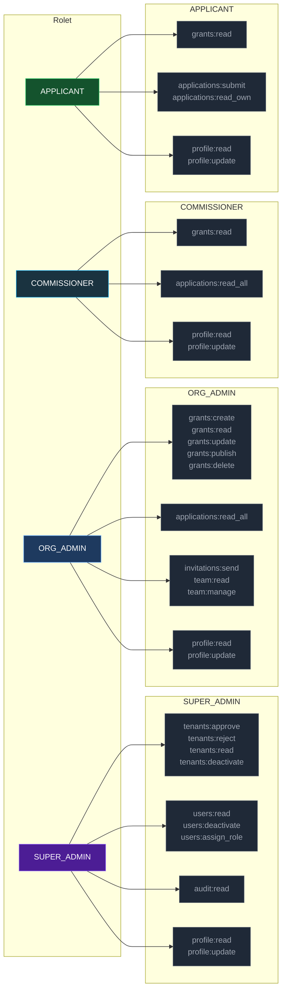
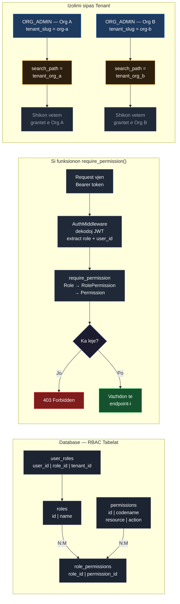

# RBAC & Permissions

GrantFlow uses a **database-driven Role-Based Access Control** system. Permissions are stored as `resource:action` string pairs and assigned to roles via the `role_permissions` join table. The `require_permission()` dependency enforces them at the endpoint level.

---

## Roles & Permissions

---

## How `require_permission()` Works

---

## Permission Matrix

| Permission | Super Admin | Org Admin | Commissioner | Applicant |
|------------|:-----------:|:---------:|:------------:|:---------:|
| `tenants:approve` | ✓ | — | — | — |
| `tenants:reject` | ✓ | — | — | — |
| `tenants:read` | ✓ | — | — | — |
| `tenants:deactivate` | ✓ | — | — | — |
| `users:read` | ✓ | — | — | — |
| `users:deactivate` | ✓ | — | — | — |
| `users:assign_role` | ✓ | — | — | — |
| `audit:read` | ✓ | — | — | — |
| `grants:create` | — | ✓ | — | — |
| `grants:read` | — | ✓ | ✓ | ✓ |
| `grants:update` | — | ✓ | — | — |
| `grants:publish` | — | ✓ | — | — |
| `grants:delete` | — | ✓ | — | — |
| `applications:read_all` | — | ✓ | ✓ | — |
| `applications:submit` | — | — | — | ✓ |
| `applications:read_own` | — | — | — | ✓ |
| `invitations:send` | — | ✓ | — | — |
| `team:read` | — | ✓ | — | — |
| `team:manage` | — | ✓ | — | — |
| `profile:read` | ✓ | ✓ | ✓ | ✓ |
| `profile:update` | ✓ | ✓ | ✓ | ✓ |

---

## Tenant Isolation

Each approved organization gets its own PostgreSQL schema (`tenant_{slug}`). `TenantMiddleware` extracts the tenant slug from the JWT and issues `SET search_path TO tenant_{slug}, public` before every request, ensuring that all ORM queries are automatically scoped to that organization's data. No cross-tenant data leakage is possible at the query level.
